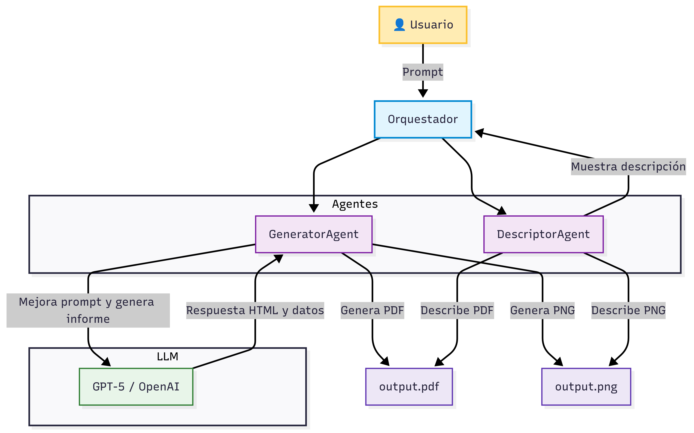
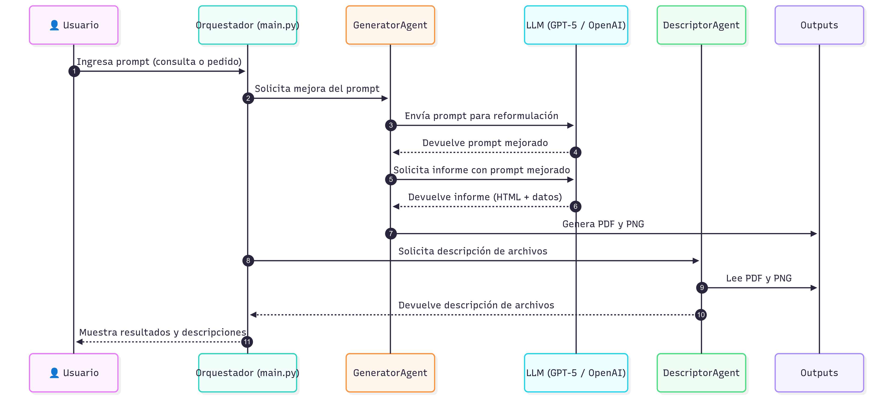

# autogen-mcp-agent-app


---

## Contexto del Proyecto

Este proyecto corresponde al **Trabajo Final** del curso de **Sistemas Inteligentes**, dictado por el Dr. Araujo Pedro.

### Objetivo

El objetivo principal de este sistema es **automatizar la generación y análisis de contenido digital** a partir de consultas en lenguaje natural, utilizando tecnologías de inteligencia artificial de última generación.

El sistema emplea la librería **autogen** para la orquestación de agentes inteligentes y utiliza un modelo de lenguaje grande (LLM), en este caso **GPT-5** (vía OpenAI), para procesar las solicitudes del usuario.

El flujo principal consiste en:

- El usuario ingresa cualquier consulta o pedido textual (por ejemplo, informes, recetas, cuentos, análisis de datos, etc.).
- El sistema envía ese pedido al LLM para que lo **mejore y lo adapte** automáticamente a un formato ideal para la generación de informes.
- El agente generador consulta al LLM con el prompt mejorado y procesa la respuesta, extrayendo tanto el texto como posibles datos estructurados.
- Si el modelo devuelve datos en formato lista, el sistema genera automáticamente una gráfica PNG.
- Se crea un informe PDF visualmente atractivo, que incluye el prompt del usuario, el texto generado por el LLM y la gráfica si corresponde.
- Un agente descriptor analiza y describe automáticamente los archivos generados, mostrando un resumen en consola.

Este enfoque permite demostrar la integración de agentes inteligentes, procesamiento de lenguaje natural y generación automática de documentos, todo en un flujo flexible y adaptable a cualquier tipo de consulta.

---

## Estructura del Proyecto

```
autogen-mcp-agent-app
├── src
│   ├── main.py                # Punto de entrada de la aplicación
│   ├── agents
│   │   ├── generator_agent.py # Genera contenido y guarda archivos
│   │   └── descriptor_agent.py# Describe el contenido de los archivos generados
│   ├── utils
│   │   ├── file_generator.py  # Funciones utilitarias para generación de archivos
│   │   └── file_reader.py     # Funciones utilitarias para lectura de archivos
│   └── types
│       └── index.py           # Tipos de datos e interfaces
├── requirements.txt           # Dependencias del proyecto
├── .env                       # Variables de entorno (API Key, modelo, etc.)
└── README.md                  # Documentación del proyecto
```

---

## Instalación

1. **Clona el repositorio:**
   ```bash
   git clone https://github.com/mataguper20/autogen-mcp-agent-app.git
   cd autogen-mcp-agent-app
   ```

2. **Crea y activa un entorno virtual (recomendado):**
   ```bash
   python3 -m venv venv
   source venv/bin/activate  # En Mac/Linux
   venv\Scripts\activate     # En Windows
   ```

3. **Instala las dependencias:**
   ```bash
   pip install -r requirements.txt
   ```

4. **Configura tu archivo `.env`:**
   Crea un archivo `.env` en la raíz del proyecto con el siguiente contenido:
   ```
   API_KEY=sk-...tu_api_key_de_openai...
   MODEL_NAME=gpt-5-nano-2025-08-07
   ```
   Puedes cambiar el modelo por otro compatible con tu API Key.

---

## Requisitos y configuración necesaria

Para que el programa funcione correctamente, debes tener:

- **Python 3.8 o superior** (recomendado Python 3.10+)
- **Acceso a la API de OpenAI** y una API Key válida
- **Sistema operativo:** Mac, Linux o Windows

### Archivos y configuración obligatoria

1. **Entorno virtual (opcional pero recomendado):**
   - Crea y activa un entorno virtual para aislar las dependencias.

2. **Instalación de dependencias:**
   - Ejecuta:
     ```bash
     pip install -r requirements.txt
     ```

3. **Archivo `.env` en la raíz del proyecto:**
   - Debes crear un archivo llamado `.env` con el siguiente contenido (reemplaza por tu propia API Key):
     ```
     API_KEY=sk-...tu_api_key_de_openai...
     MODEL_NAME=gpt-5-nano-2025-08-07
     ```
   - **Importante:** El archivo `.env` nunca debe subirse a GitHub. Ya está incluido en `.gitignore`.

4. **Dependencias principales:**
   - El archivo `requirements.txt` incluye todas las librerías necesarias, como:
     - `openai`
     - `python-dotenv`
     - `matplotlib`
     - `weasyprint`
     - `jinja2`
     - `PyPDF2`
     - `Pillow`
   - Instálalas con el comando anterior.

5. **Estructura mínima de carpetas y archivos:**
   - Debes tener la siguiente estructura:
     ```
     autogen-mcp-agent-app/
     ├── src/
     │   ├── main.py
     │   └── agents/
     │       ├── generator_agent.py
     │       └── descriptor_agent.py
     ├── requirements.txt
     ├── .env
     └── .gitignore
     ```

---

**Si cumples con estos requisitos y configuraciones, el programa funcionará correctamente en cualquier equipo.**

## Uso

1. **Ejecuta el programa:**
   ```bash
   python src/main.py
   ```

2. **Ingresa tu consulta cuando se te pida:**
   - Ejemplo: `Receta de pizza`
   - Ejemplo: `Informe sobre la evolución del dólar en Argentina en los últimos 30 días`
   - Ejemplo: `Cuento corto sobre un dragón`
   - Ejemplo: `Gráfico de temperaturas en Buenos Aires durante el último mes`
   - Ejemplo: `Quiero un informe detallado, de los últimos 15 presidentes de Argentina, teniendo en cuenta cuando asumieron, cuando dejaron el cargo, y en conjunto a eso, cuantos habitantes había en el país en cada uno de esos periodos`

3. **Resultados:**
   - Se generarán automáticamente dos archivos en la carpeta del proyecto:
     - `output.pdf` (informe visualmente atractivo, incluye tu prompt y el resultado del LLM, y la gráfica si hay datos)
     - `output.png` (gráfico generado si el LLM devuelve datos en formato lista)

4. **Descripción automática:**
   - El programa mostrará en consola una descripción de cada archivo generado.

---

## Agentes

- **GeneratorAgent**: Interactúa con el modelo de lenguaje para crear contenido según el input del usuario y guarda el resultado en PDF y/o PNG.
- **DescriptorAgent**: Abre los archivos generados y provee una descripción automática de su contenido.

---

## Recomendaciones para el prompt del usuario

El sistema es capaz de mejorar automáticamente el prompt del usuario para obtener informes claros y completos.  
Sin embargo, para mejores resultados, puedes usar prompts como:

```
Quiero un informe detallado sobre los últimos 15 presidentes de Argentina, incluyendo nombre, fechas de mandato y cantidad de habitantes al inicio de cada periodo. Presenta la información en HTML y, si es posible, genera una lista de habitantes en formato Python para graficar.
```

O simplemente:

```
Receta de pizza.
```

El sistema se encargará de adaptar y mejorar el prompt para generar el informe adecuado.

---

## Visualización de la arquitectura y el flujo del sistema

A continuación se presentan dos diagramas que ilustran el funcionamiento interno del sistema:

- **Estructura del sistema:**  
  Este diagrama muestra los principales componentes del proyecto, la organización de los agentes y cómo interactúan entre sí y con los archivos generados.


---



- **Diagrama de secuencia:**  
  Este diagrama representa el flujo de mensajes y acciones entre el usuario, el orquestador, los agentes, el modelo LLM y los archivos de salida, desde que se ingresa un prompt hasta la generación y descripción de los resultados.



---

## Contacto

**Autor:** Matías Pérez  
**Email:** mataguper20@gmail.com  
**GitHub:** [github.com/mataguper20](https://github.com/mataguper20)

---

## Licencia

Este proyecto se distribuye bajo la licencia MIT.

---

## Notas importantes

- Asegúrate de tener una API Key válida de OpenAI.
- Si usas otro modelo, verifica que sea compatible con la API y el cliente utilizado.
- Si tienes problemas con dependencias, revisa que tu entorno virtual esté activo y que uses el comando `pip install -r requirements.txt`.

---

## Preguntas frecuentes

**¿Puedo pedir cualquier cosa al LLM?**  
Sí, el sistema es flexible y adapta el PDF y la gráfica según el contenido generado.

**¿Qué pasa si el LLM no devuelve datos para graficar?**  
Solo se genera el PDF con el texto y el prompt.

**¿Puedo cambiar el formato del PDF?**  
Sí, puedes modificar el CSS en el archivo `generator_agent.py` para personalizar el diseño.

---

¡Gracias por usar autogen-mcp-agent-app!